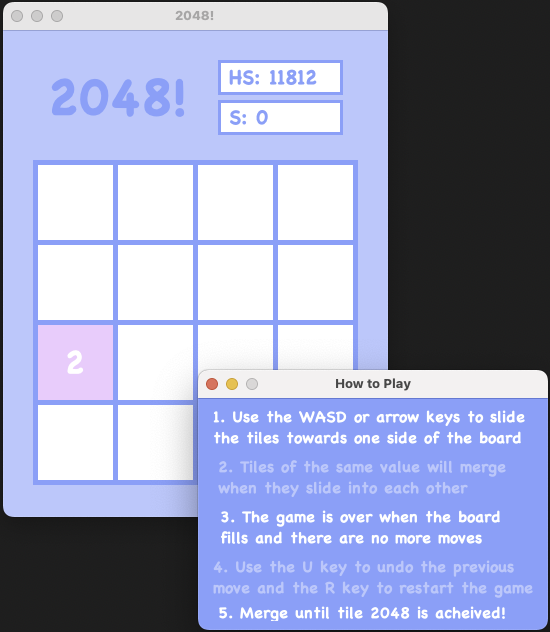
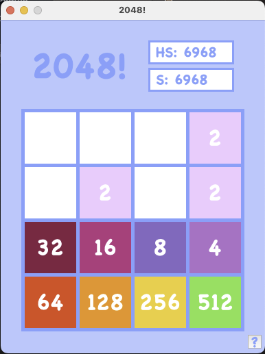
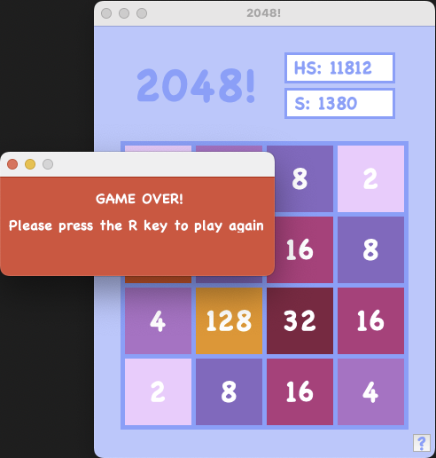

# 2048

An imitation of the popular mobile puzzle game 2048, implemented in Java using the Swing GUI framework.

## Repository Configuration
| Folder | Contents |
|--------|-----------|
| `Code/` | Java source files for the game |
| `Images/` | Preview screenshots of the game |
| `G2048.jar` | Runnable version of the game |

## Set up

1. Download `G2048.jar` from this repository.
2. Make sure you have Java installed.
3. Double-click the JAR file, or run the game from a terminal with:

```bash
java -jar G2048.jar
```

## How to Play
Two tiles with the same value merge into a new tile with double the value when they collide. Your objective is to merge tiles to create the 2048 tile, or go beyond for a higher score.

## Controls
| Key(s) | Action |
|:------:|--------|
| ↑ / W  | Move tiles up |
| ↓ / S  | Move tiles down |
| ← / A  | Move tiles left |
| → / D  | Move tiles right |
| U      | Undo previous move |
| R      | Restart the game |

## Preview
<p align="center">
    
    
    
</p>